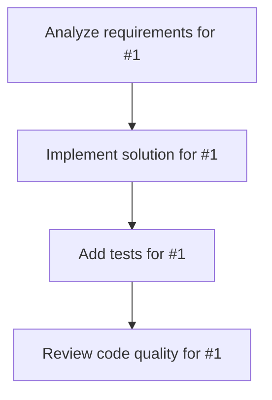

# Plans for Issue #1

**Title**: Potential Labs コーポレートサイト開発

**URL**: https://github.com/FinShinjuku/potential-labs-lp/issues/1

---

## 📋 Summary

- **Total Tasks**: 4
- **Estimated Duration**: 60 minutes
- **Execution Levels**: 4
- **Has Cycles**: ✅ No

## 📝 Task Breakdown

### 1. Analyze requirements for #1

- **ID**: `task-1-analysis`
- **Type**: Docs
- **Assigned Agent**: IssueAgent
- **Priority**: 0
- **Estimated Duration**: 5 min

**Description**: Analyze issue requirements and create detailed specification

### 2. Implement solution for #1

- **ID**: `task-1-impl`
- **Type**: Feature
- **Assigned Agent**: CodeGenAgent
- **Priority**: 1
- **Estimated Duration**: 30 min
- **Dependencies**: task-1-analysis

**Description**: ## 🎯 プロジェクト概要
Potential Labsの新規コーポレートLP開発

## 🏢 会社情報
- **会社名**: Potential Labs
- **コンセプト**: 不可能を可能にする
- **メインコピー**: テクノロジーで、人の可能性をひらく。
- **サブコピー**: 
  クラウド、AI、データ。
  それらは"効率化のための道具"ではなく、
  "人が本来の力を発揮するためのきっかけ"だと、私たちは考えています。

## 💼 サービス内容
1. AI、AWS、BytePlusを使った受託開発
2. 音楽の未来を変えるソリューション

## 🛠 技術スタック
- Next.js 14 (App Router)
- shadcn/ui
- Tailwind CSS
- TypeScript

## 📑 セクション構成
- [ ] ヒーロー（メインビジュアル + メインコピー）
- [ ] サービス/プロダクト紹介（2つのサービス）
- [ ] 会社概要・チーム紹介（創業者の写真含む）
- [ ] お問い合わせフォーム

## 🎨 デザイン要件
- モダンでクリーンなデザイン
- レスポンシブ対応（モバイルファースト）
- スムーズなアニメーション・インタラクション
- shadcn/uiコンポーネント活用

## 📝 実装タスク
- [ ] Next.js環境セットアップ
- [ ] shadcn/ui初期化
- [ ] ヒーローセクション実装
- [ ] サービス紹介セクション実装
- [ ] 会社概要・チーム紹介セクション実装
- [ ] お問い合わせフォーム実装
- [ ] レスポンシブ対応
- [ ] アニメーション実装
- [ ] SEO対策（メタタグ、OGP等）

### 3. Add tests for #1

- **ID**: `task-1-test`
- **Type**: Test
- **Assigned Agent**: CodeGenAgent
- **Priority**: 2
- **Estimated Duration**: 15 min
- **Dependencies**: task-1-impl

**Description**: Create comprehensive test coverage

### 4. Review code quality for #1

- **ID**: `task-1-review`
- **Type**: Refactor
- **Assigned Agent**: ReviewAgent
- **Priority**: 3
- **Estimated Duration**: 10 min
- **Dependencies**: task-1-test

**Description**: Run quality checks and code review

## 🔄 Execution Plan (DAG Levels)

Tasks can be executed in parallel within each level:

### Level 0 (Parallel Execution)

- `task-1-analysis` - Analyze requirements for #1

### Level 1 (Parallel Execution)

- `task-1-impl` - Implement solution for #1

### Level 2 (Parallel Execution)

- `task-1-test` - Add tests for #1

### Level 3 (Parallel Execution)

- `task-1-review` - Review code quality for #1

## 📊 Dependency Graph

## ⏱️ Timeline Estimation

- **Sequential Execution**: 60 minutes (1.0 hours)
- **Parallel Execution (Critical Path)**: 10 minutes (0.2 hours)
- **Estimated Speedup**: 6.0x

---

*Generated by CoordinatorAgent on 2025-10-29 03:29:09 UTC*
